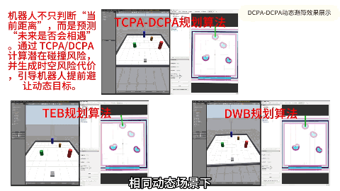
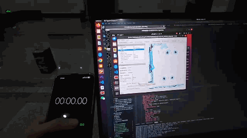
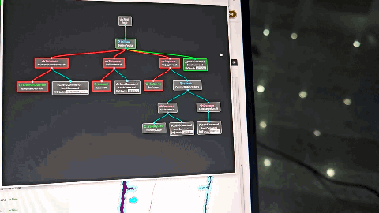
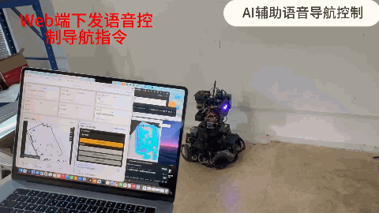
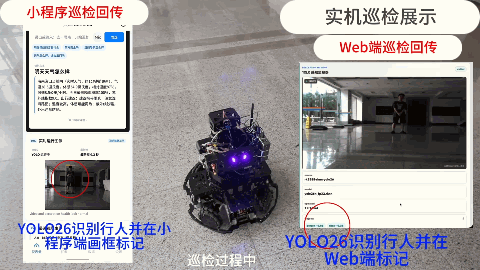

  

  <a href="mailto:20243007059@hainanu.edu.cn">Email</a>
  &nbsp;·&nbsp;
  <a href="https://github.com/LRaina215/SNAKE_TPCA-DCPA_NAV">Predictive Navigation</a>
  &nbsp;·&nbsp;
  <a href="https://github.com/LRaina215/HNU_NHS_SENTRY_UP">RoboMaster Sentry</a>
  &nbsp;·&nbsp;
  <a href="https://github.com/LRaina215/QHXD_Web">Multimodal Mobile Robot</a>

## About Me

我是海南大学信息与通信工程学院智能科学与技术专业本科生，研究与项目实践主要围绕移动机器人自主导航、机器人视觉、自主决策与机器人系统集成展开。

我关注算法在真实机器人系统中的完整落地：从感知、定位、规划与控制，到任务管理、上下位机通信和多端交互。目前也在系统学习强化学习与具身智能基础，希望逐步将已有的导航与工程能力拓展到更通用的智能体感知、决策与控制问题。

> Undergraduate in Intelligent Science and Technology at Hainan University, working on robotics, autonomous navigation, robot perception, decision-making, and system integration.

## Selected Projects

### 01 · Predictive Navigation in Dynamic Environments

**面向动态环境的移动机器人平滑预测导航** · [Repository](https://github.com/LRaina215/SNAKE_TPCA-DCPA_NAV)

  

- 主导基于常速度卡尔曼滤波动态障碍跟踪和 TCPA/DCPA 各向异性时空风险场的 Nav2/DWB 局部规划方法设计与实现。
- 引入横向逃逸与方向翻转抑制机制，并在 Gazebo 中搭建动态障碍场景开展对比实验。
- 对比标准 DWB，仿真实验中的导航成功率由 60% 提升至 100%。

### 02 · RoboMaster Sentry Autonomy

**哨兵机器人自主决策、导航与视觉自瞄系统** · [Navigation & Decision](https://github.com/LRaina215/HNU_NHS_SENTRY_UP) · [Vision & Auto-aim](https://github.com/LRaina215/HNU_NHS_SENTRY)

  
  &nbsp;
  

- 负责自主导航与决策系统开发，完成 Point-LIO、Terrain Analysis、ICP、Theta* 与 DWB 的选型、集成、参数调优及实车联调。
- 基于 BehaviorTree.CPP 实现巡逻、追击、交战和低血量回防等战术决策。
- 搭建并改进 ROS2 自瞄系统，完成装甲板识别、位姿解算、目标跟踪与上下位机通信联调。

### 03 · Multimodal Inspection & Delivery Robot

**多模态自主巡检配送机器人** · [System Platform](https://github.com/LRaina215/QHXD_Web) · [Navigation](https://github.com/LRaina215/QHXD_NAV) · [Live](https://lingxunrobot.cn)

  
  &nbsp;
  

- 负责 RK3588 上位机系统总体设计与整车集成，实现导航、感知、任务管理、上下位机通信及多端交互模块协同。
- 集成 Point-LIO、Theta* 与 Omni PID Pursuit，完成机器人自主导航与多航点巡检。
- 部署 YOLO26、FunASR、DeepSeek 与 TTS，构建视觉感知、自然语言交互和任务反馈链路。
- 开发 FastAPI 机器人后端、Cloud Gateway、Vue Web 平台与微信小程序，并完成公网部署与上线。

### 04 · Bio-inspired Snake Robot (National Innovation Project)

**面向三维复杂空间具备环境监测与自主运动能力的仿生机器蛇研发** · 国家级大学生创新创业训练计划 · 负责人 · [Navigation Module](https://github.com/LRaina215/SNAKE_TPCA-DCPA_NAV)

- 主导仿生机器蛇系统总体方案：融合环境感知、三维定位、自主导航与多步态运动控制，面向化工厂、建筑废墟等危险、狭窄且非结构化三维空间的环境监测与巡检。
- 提出利用蛇身与地面接触形成自支撑基座的构型构想，基于 MuJoCo 完成多版构型与步态仿真迭代。
- 参与上管步态方案实机验证，负责运动学公式推导、步态示意图绘制与实验结果分析。
- 目前正独立开展蛇形机器人顺应性运动控制（compliant motion control）方向的研究，工作进行中。
- 本项目的预测导航方法研究作为独立课题展开（见 Project 01，EI 会议论文已录用）。

## Research Outputs

| Type | Work | Status |
| --- | --- | --- |
| Conference paper | *Anisotropic Spatiotemporal Risk Field for Smooth Predictive Navigation of Mobile Robots in Dynamic Environments* | ACIRS 2026 · accepted · first author |
| Invention patent | 移动机器人预测性导航与动态避障方法及系统 | formally accepted · second inventor |
| Invention patent | 一种蛇形机器人从支撑平面挂载至悬空水平管道的方法及系统 | formally accepted · third inventor |

## Selected Honors

- 中国机器人及人工智能大赛机器人创新赛 · 国家级一等奖
- 高教杯全国大学生数学建模竞赛 · 国家级二等奖
- 全国大学生机器人大赛 RoboMaster 竞技奖 · 国家级三等奖
- 海南大学 2024–2025 学年一等奖学金

## Technical Profile

| Area | Tools & Experience |
| --- | --- |
| Robot systems | ROS2, SLAM, Nav2, BehaviorTree.CPP, robot integration and debugging |
| Simulation | MuJoCo, Gazebo |
| Programming | C/C++, Python, Linux, Git |
| Vision & numerical tools | OpenCV, Eigen, NumPy, Matplotlib |
| System engineering | RK3588, FastAPI, Vue, HTTPS/WSS, edge-cloud communication |
| Currently learning | Reinforcement learning fundamentals and embodied intelligence |

---

  欢迎就机器人自主导航、具身智能与机器人系统实践交流 · <a href="mailto:20243007059@hainanu.edu.cn">20243007059@hainanu.edu.cn</a>

